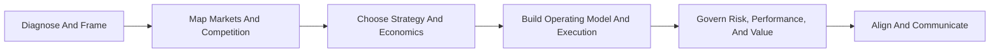

# 21 McKinsey-Style Strategy Skills for Claude


> Inspired by McKinsey-style problem solving and broader MBB consulting practice: crisp framing, MECE logic, hypothesis-led analysis, 80/20 focus, answer-first communication, and executive-ready recommendations. This collection is independent and unofficial.

## What This Is

This repository contains 21 standalone Claude skills for strategy work, grouped into six practical consulting domains. Each skill is a small, uploadable workflow that teaches Claude how to perform one high-value consulting task with a repeatable McKinsey-style method.

Together, the skills operate like a consulting AI operating system for a full engagement: diagnose the problem, map the market, choose a strategic path, translate it into execution, govern value, and communicate the recommendation.

The collection is designed for business builders, operators, consultants, analysts, founders, and strategy teams who want Claude to work closer to a top 1% MBB-style consultant: structured before analytical, hypothesis-led before exhaustive, and executive-ready before verbose.



## Why It Exists

Most strategy prompts fail because they ask for insight before the work is structured. This consulting AI operating system gives Claude a reusable engagement backbone that helps it:

✓ frame the real decision  
✓ separate symptoms from causes  
✓ make assumptions visible  
✓ build MECE structures  
✓ prioritize the few moves that matter  
✓ stress-test recommendations before they meet reality  
✓ communicate in a board-ready way  

## Collection Map

```text
strategy-skills-for-claude/
│
├── README.md
│
└── skills/
    ├── 01-diagnosis-and-framing/
    │   ├── situation-assessment.md
    │   ├── growth-barriers.md
    │   └── assumption-audit.md
    ├── 02-market-and-competitive-intelligence/
    │   ├── market-mapping.md
    │   ├── competitive-intel.md
    │   ├── customer-segmentation.md
    │   └── profit-pool-analysis.md
    ├── 03-strategic-choice-and-economics/
    │   ├── strategic-options.md
    │   ├── pricing-strategy.md
    │   ├── business-case-builder.md
    │   └── portfolio-review.md
    ├── 04-operating-model-and-execution/
    │   ├── operating-model-design.md
    │   ├── initiative-prioritizer.md
    │   └── transformation-roadmap.md
    ├── 05-risk-performance-and-value-governance/
    │   ├── war-gaming.md
    │   ├── risk-and-mitigation.md
    │   ├── kpi-architect.md
    │   └── value-realization.md
    └── 06-alignment-and-executive-communication/
        ├── stakeholder-alignment.md
        ├── narrative-builder.md
        └── decision-memo.md
```

Each markdown file under `skills/` is an individual skill definition. To upload one into Claude, place the chosen file in a temporary folder and name it `SKILL.md`.

## The 21 Skills

### 1. Diagnosis and Framing

Use these when the team needs to understand the real problem before choosing a move. The style is McKinsey-inspired: fact base first, root cause discipline, explicit assumptions, and a clear question to answer.

| Skill | Use It When | Output |
|---|---|---|
| [Situation Assessment](skills/01-diagnosis-and-framing/situation-assessment.md) | You need the factual baseline before choosing a direction | Fact base, momentum read, issues list |
| [Growth Barriers](skills/01-diagnosis-and-framing/growth-barriers.md) | Growth is stuck and leadership is debating symptoms | Constraint diagnosis and evidence plan |
| [Assumption Audit](skills/01-diagnosis-and-framing/assumption-audit.md) | A strategy depends on beliefs that may be weak | Assumption register and test plan |

### 2. Market and Competitive Intelligence

Use these when the answer depends on where value is, how customers differ, how rivals may behave, or where the attractive space sits.

| Skill | Use It When | Output |
|---|---|---|
| [Market Mapping](skills/02-market-and-competitive-intelligence/market-mapping.md) | You need to size, segment, and map white space | Market map and where-to-play options |
| [Competitive Intel](skills/02-market-and-competitive-intelligence/competitive-intel.md) | You need to predict likely competitor moves | Rival move map and response plan |
| [Customer Segmentation](skills/02-market-and-competitive-intelligence/customer-segmentation.md) | You need sharper customer groups for strategy decisions | MECE segments and segment priorities |
| [Profit Pool Analysis](skills/02-market-and-competitive-intelligence/profit-pool-analysis.md) | You need to know where value is created and captured | Profit pool map and strategic implications |

### 3. Strategic Choice and Economics

Use these when leaders need choices, trade-offs, economics, and allocation decisions. These skills push Claude toward option-aware, evidence-backed recommendations rather than single-answer advocacy.

| Skill | Use It When | Output |
|---|---|---|
| [Strategic Options](skills/03-strategic-choice-and-economics/strategic-options.md) | You need alternatives before committing to a path | Option set, criteria, recommendation |
| [Pricing Strategy](skills/03-strategic-choice-and-economics/pricing-strategy.md) | Pricing power, discounting, or monetization is unclear | Pricing diagnosis and action plan |
| [Business Case Builder](skills/03-strategic-choice-and-economics/business-case-builder.md) | A decision needs economics, sensitivities, and risks | Business case and decision logic |
| [Portfolio Review](skills/03-strategic-choice-and-economics/portfolio-review.md) | You need to allocate resources across bets | Portfolio diagnosis and allocation choices |

### 4. Operating Model and Execution

Use these when the strategy must become work: capabilities, decision rights, initiative choices, roadmaps, owners, and the first 90 days.

| Skill | Use It When | Output |
|---|---|---|
| [Operating Model Design](skills/04-operating-model-and-execution/operating-model-design.md) | Strategy needs translation into how work gets done | Capabilities, governance, decision rights |
| [Initiative Prioritizer](skills/04-operating-model-and-execution/initiative-prioritizer.md) | Too many initiatives compete for attention | Ranked roadmap and kill list |
| [Transformation Roadmap](skills/04-operating-model-and-execution/transformation-roadmap.md) | A strategy must become sequenced execution | Phased roadmap, owners, risks |

### 5. Risk, Performance, and Value Governance

Use these when the recommendation needs pressure-testing, risk control, measurement, and value capture. The standard is a board-ready governance view, not a generic risk list.

| Skill | Use It When | Output |
|---|---|---|
| [War Gaming](skills/05-risk-performance-and-value-governance/war-gaming.md) | A strategy needs pressure-testing before launch | Scenario stress test and response moves |
| [Risk and Mitigation](skills/05-risk-performance-and-value-governance/risk-and-mitigation.md) | Strategic risk needs an owner and response plan | Risk register and contingencies |
| [KPI Architect](skills/05-risk-performance-and-value-governance/kpi-architect.md) | Metrics are noisy, lagging, or performative | Decision-linked KPI system |
| [Value Realization](skills/05-risk-performance-and-value-governance/value-realization.md) | Benefits must be tracked after launch | Value ledger and governance model |

### 6. Alignment and Executive Communication

Use these when the work must survive the meeting: pre-wire stakeholders, sharpen the executive story, and turn the recommendation into a written decision.

| Skill | Use It When | Output |
|---|---|---|
| [Stakeholder Alignment](skills/06-alignment-and-executive-communication/stakeholder-alignment.md) | The recommendation needs pre-wiring before the meeting | Stakeholder map and engagement plan |
| [Narrative Builder](skills/06-alignment-and-executive-communication/narrative-builder.md) | You need the story to land in the first 60 seconds | Pyramid story, SCQA, hostile Q&A |
| [Decision Memo](skills/06-alignment-and-executive-communication/decision-memo.md) | An executive needs a clear recommendation in writing | Decision memo with options and next steps |

## How To Install

This repository keeps the 21 skills as standalone markdown files grouped under `skills/`. Claude expects an uploaded skill folder to contain a file named `SKILL.md`, so use a small temporary folder when you want to install one.

1. Pick a markdown file under one of the `skills/` category folders.
2. Create a temporary folder with the skill name.
3. Copy the chosen markdown file into that folder as `SKILL.md`.
4. Zip that temporary folder if your Claude surface requires upload as a zip.
5. Upload or place it in your Claude skills directory.
6. Test with a clear strategy prompt.

Example:

```bash
cd strategy-skills-for-claude
mkdir -p upload/market-mapping
cp skills/02-market-and-competitive-intelligence/market-mapping.md upload/market-mapping/SKILL.md
cd upload
zip -r market-mapping.zip market-mapping
```

## How To Choose A Skill

```text
Need truth about the current situation?        -> 01-diagnosis-and-framing/situation-assessment
Need to unblock growth?                        -> 01-diagnosis-and-framing/growth-barriers
Need to test strategy beliefs?                 -> 01-diagnosis-and-framing/assumption-audit

Need to find attractive spaces?                -> 02-market-and-competitive-intelligence/market-mapping
Need to understand rivals?                     -> 02-market-and-competitive-intelligence/competitive-intel
Need better customer groups?                   -> 02-market-and-competitive-intelligence/customer-segmentation
Need to find where money is made?              -> 02-market-and-competitive-intelligence/profit-pool-analysis

Need options before deciding?                  -> 03-strategic-choice-and-economics/strategic-options
Need better monetization?                      -> 03-strategic-choice-and-economics/pricing-strategy
Need the economics of a move?                  -> 03-strategic-choice-and-economics/business-case-builder
Need to allocate across bets?                  -> 03-strategic-choice-and-economics/portfolio-review

Need to redesign how work happens?             -> 04-operating-model-and-execution/operating-model-design
Need to cut the initiative list?               -> 04-operating-model-and-execution/initiative-prioritizer
Need a delivery plan?                          -> 04-operating-model-and-execution/transformation-roadmap

Need to stress-test reality?                   -> 05-risk-performance-and-value-governance/war-gaming
Need strategic risk control?                   -> 05-risk-performance-and-value-governance/risk-and-mitigation
Need better metrics?                           -> 05-risk-performance-and-value-governance/kpi-architect
Need to make benefits stick?                   -> 05-risk-performance-and-value-governance/value-realization

Need to win approval before the meeting?       -> 06-alignment-and-executive-communication/stakeholder-alignment
Need the story?                                -> 06-alignment-and-executive-communication/narrative-builder
Need a written executive decision?             -> 06-alignment-and-executive-communication/decision-memo
```

## Example Prompts

```text
Use the market-mapping skill to size the opportunity for a B2B payments product in Germany.
```

```text
Use the assumption-audit skill to pressure-test our expansion strategy before the board meeting.
```

```text
Use the narrative-builder skill to turn this recommendation into a McKinsey-style executive story.
```

```text
Use the initiative-prioritizer skill to cut this list of 18 projects into the 3 that matter.
```

## Design Standards Used

This collection follows the Claude skill-building guide:

✓ each skill definition includes valid `SKILL.md` frontmatter  
✓ skill file names use kebab-case  
✓ frontmatter includes `name` and `description`  
✓ descriptions include what the skill does and when to use it  
✓ skills are grouped into six consulting domains for easier selection  
✓ instructions are concise and actionable  
✓ each skill includes a workflow, output format, and quality bar  

## Positioning Note

"McKinsey-style" refers to a school of strategy problem solving: structured issue diagnosis, MECE thinking, hypothesis-led analysis, 80/20 focus, pyramid communication, and rigorous recommendation design. It is appropriate to describe these as McKinsey-inspired, McKinsey-style, or based on common McKinsey-style frameworks. Avoid any wording that implies McKinsey authorship, affiliation, or endorsement.

## Quality Bar

Every skill is designed to push Claude toward outputs that are:

✓ decision-oriented  
✓ structured before analytical  
✓ evidence-aware  
✓ assumption-conscious  
✓ executive-readable  
✓ specific enough to act on  

